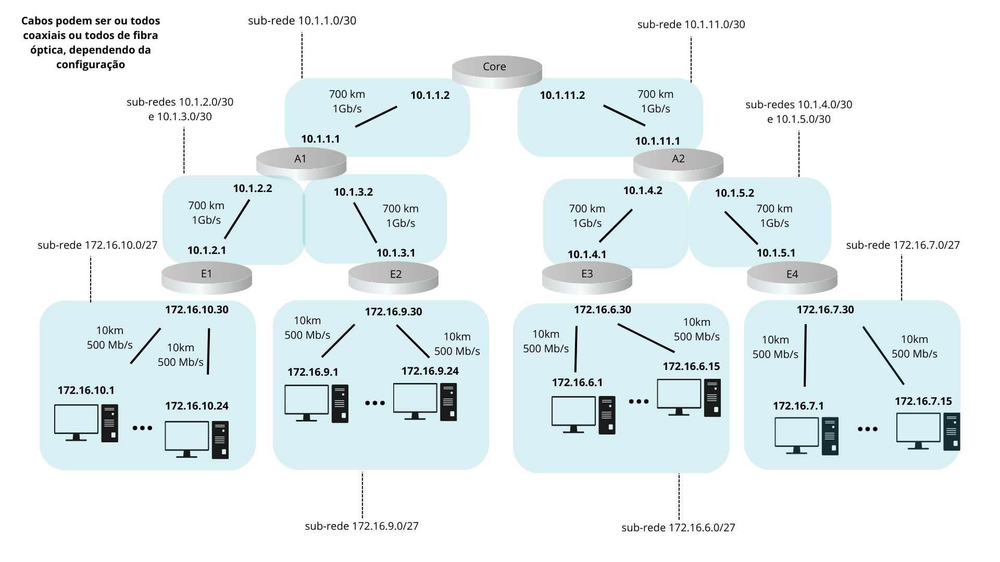

# Network Simulator

Este projeto configura um ambiente interativo simples para simular comandos de rede (`ping`, `traceroute`) em uma rede simulada em um grafo. Cada vértice no grafo representa um host/roteador de rede e os links representam caminhos entre os hosts/roteadores.

## Funcionalidades
- Simula o comando `ping` para verificar a conectividade entre hosts.
- Simula o comando `traceroute` para mapear o caminho até um destino na rede.
- Permite limpar a tela do terminal.
- Permite mudar o host atual de execução dos comandos.
- Permite alternar entre diferentes tipos de rede (`fiber` e `coaxial`).

## Instalação e Execução
### Dependências
Certifique-se de ter Python instalado na versão 3.10.10 ou mais recente (não é necessária nenhuma biblioteca externa). O projeto está estruturado com os seguintes arquivos principais:

- `utils/settings/adjascentVertices.py`: Contém as informações sobre os vértices da rede.
- `utils/functions/constructGraph.py`: Responsável por construir o grafo da rede.
- `utils/structures/terminal.py`: Define a estrutura do terminal e a execução dos comandos.

### Como executar
1. Clone este repositório:
   ```sh
   git clone git@github.com:Schatten900/RC_Trabalho2.git
   ```
2. Execute o script dentro da pasta principal do projeto:
   ```sh
   python3 main.py
   ```

## Comandos Disponíveis
O terminal interativo exibe um prompt como:
```sh
root@172.16.10.1:~$
```
Você pode usar os seguintes comandos:

### `ping <destino>`
Verifica se um host/roteador pode ser alcançado.
```sh
ping 172.16.10.2
```

### `traceroute <destino>`
Simula um traceroute para um host na rede.
```sh
traceroute 172.16.10.3
```

### `clear`
Limpa a tela do terminal.
```sh
clear
```

### `changeto <novo_host>`
Altera o host de onde os comandos são executados.
```sh
changeto 172.16.10.2
```

### `changenetwork <fiber|coaxial>`
Muda o tipo de rede entre `fiber` e `coaxial`.
```sh
changenetwork fiber
```

## Estrutura do Projeto
```
project-root/
│── main.py
│── utils/
│   ├── settings/
│   │   ├── adjascentVertices.py
│   ├── functions/
│   │   ├── constructGraph.py
│   │   ├── adatedDijkstra.py
│   │   ├── defineLinkProperties.py
│   ├── structures/
│   │   ├── terminal.py
│   │   ├── link.py
│   │   ├── graph.py
│   │   ├── vertex.py
```

# Topologia da rede simulada


## Autores
- José Neto Souza
- Luca Megiorin
- Carlos Cauã